# Orange

Orange é uma ferramenta de mineração de dados de código aberto com capacidade de visualização de dados muito forte. Ela permite que você use uma GUI (Orange Canvas) para arrastar e soltar módulos e conectá-los para avaliar e testar vários algoritmos de aprendizagem de máquina. Esse curto tutorial vai apresentar a noção básica da ferramenta.

## Instalação
As instruções de download são encontradas no site oficial: [Download do Orange](https://orangedatamining.com/download/#windows)

## Visão Geral
A aplicação tem duas áreas principais, o canvas no meio e um menu de widgets. Na execução inicial, uma tela com algumas opções é apresentada.

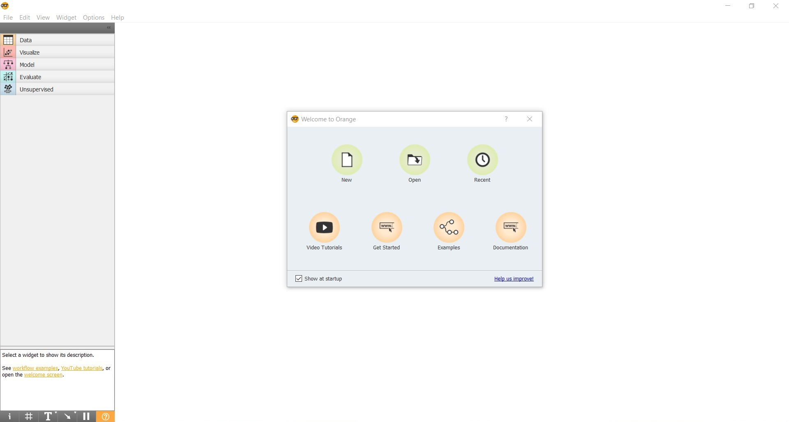

A ideia geral do Orange é conectar widgets de forma visual, arrastando do menu lateral para o canvas central e configurando os parâmetros necessários.

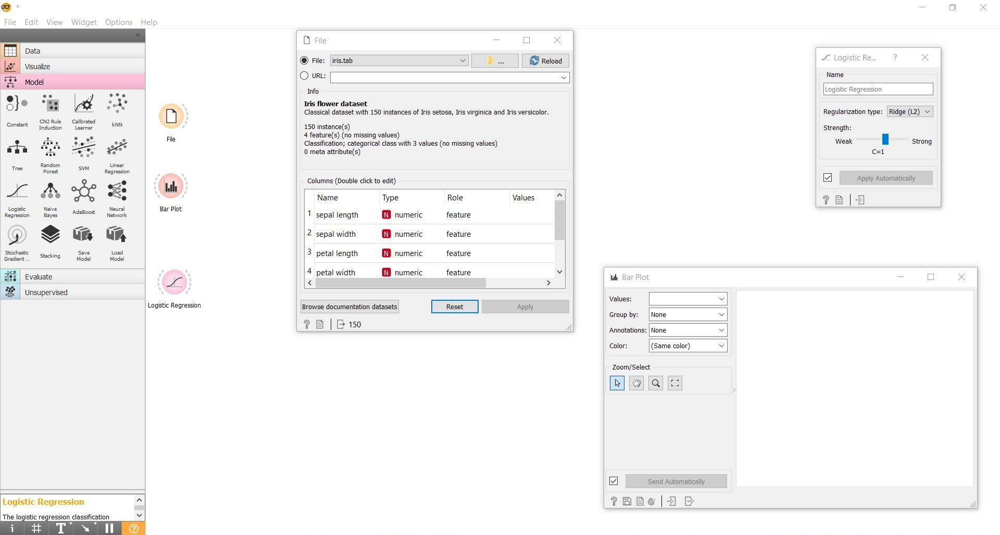

O fluxo geral de uma aplicação de aprendizado de máquina é um conjunto de passos:
* Aquisição e processamento de dados
* Criação de modelos
* Avaliação

Os widgets disponíveis são baseados nesses passos, e podem ser organizados de maneira sequencial para uso de modelos complexos.

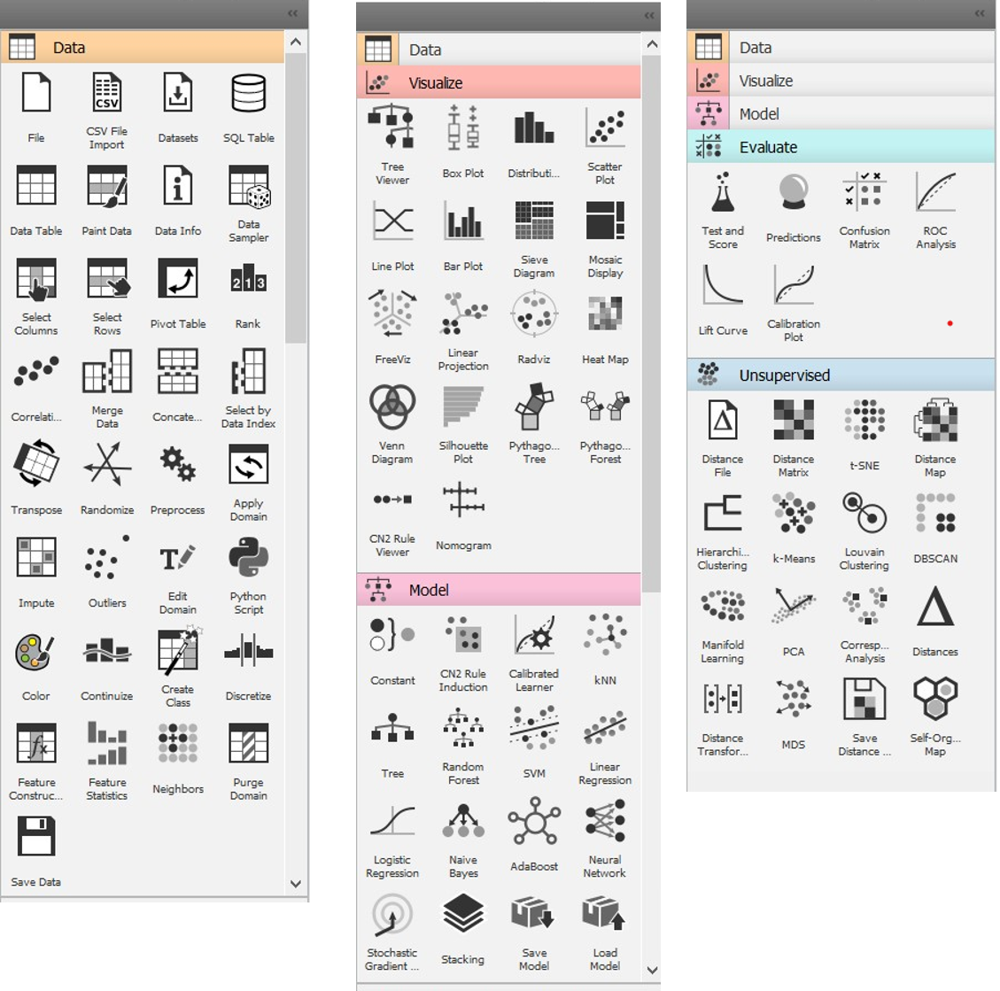

Outros widgets estão disponíves pelo próprio Orange ou fontes externas.

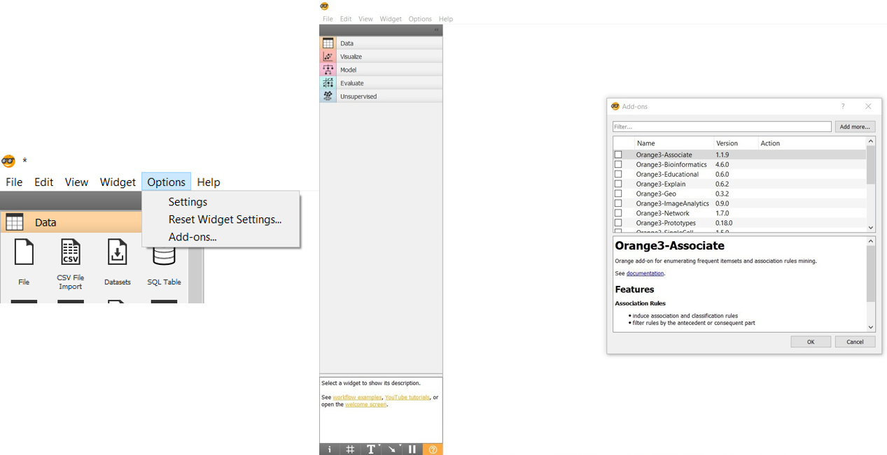

## Dados

O processamento de dados são feitas em várias etapas, e variam bastante entre cada projeto. Carregar os módulos e separar em conjunto de `treino` e `teste` são as tarefas básicas.

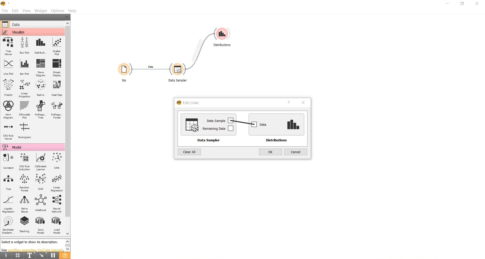

## Visualização

Os widgets de visualização precisam de uma entrada de dados, e uma seleção razoável de parâmetros, mas apresentam bem os dados.

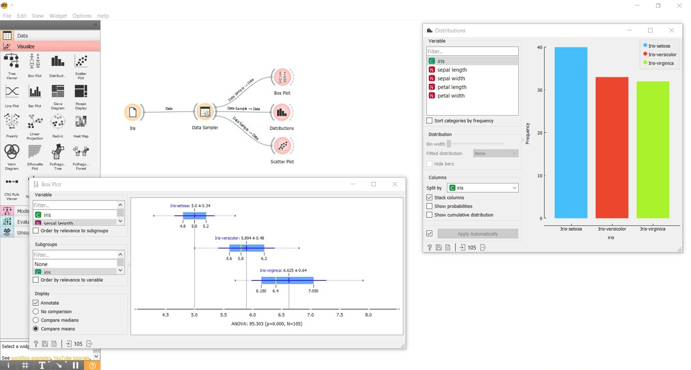

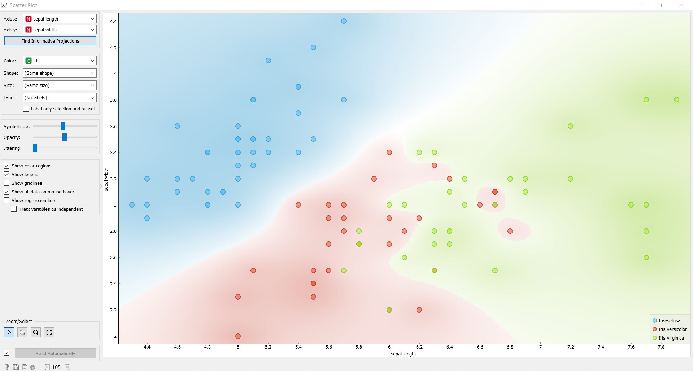

## Aprendizado

A aba de `Models` abrange os modelos de aprendizado supervisionado e `Unsurpervised` os modelos de aprendizado não supervisionado. Por hora vamos ver o projeto para modelos de aprendizado supervisionado.

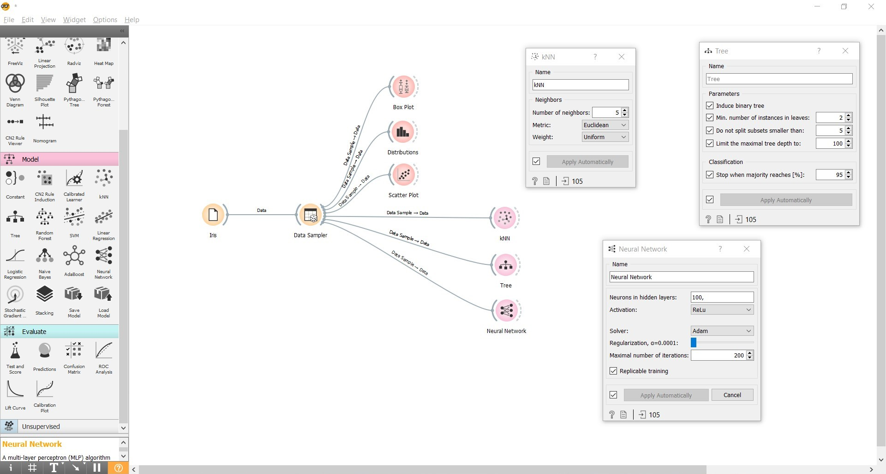

Os modelos são treinados automaticamente, e alguns deles permitem uma visualização do que foi treinado.

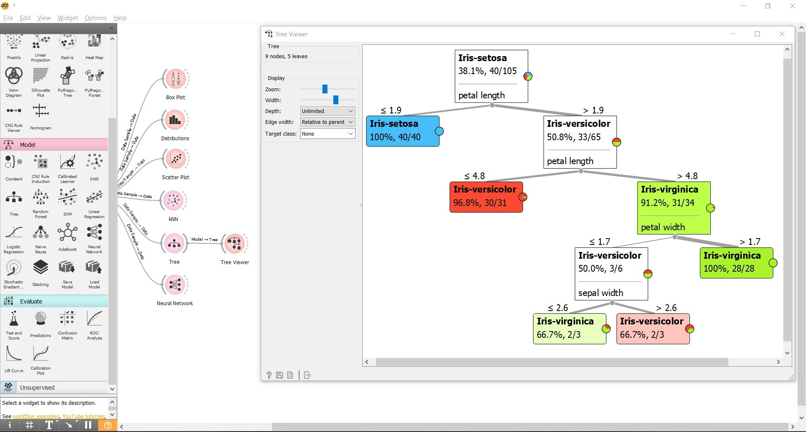

## Avaliação

Os métodos de avaliação são uma união dos modelos e dos dados. Para avaliar os modelos, é necessário comparar os resultados das predições com os dados.

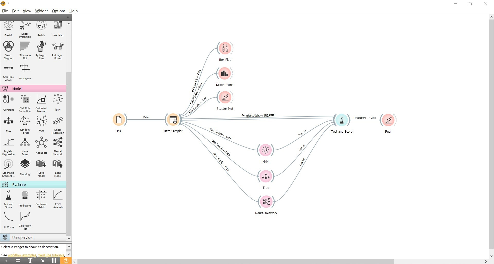

Existem vários jeitos de avaliar os modelos, mas nesse caso vamos usar os dados que não entraram no treino, a base de teste.

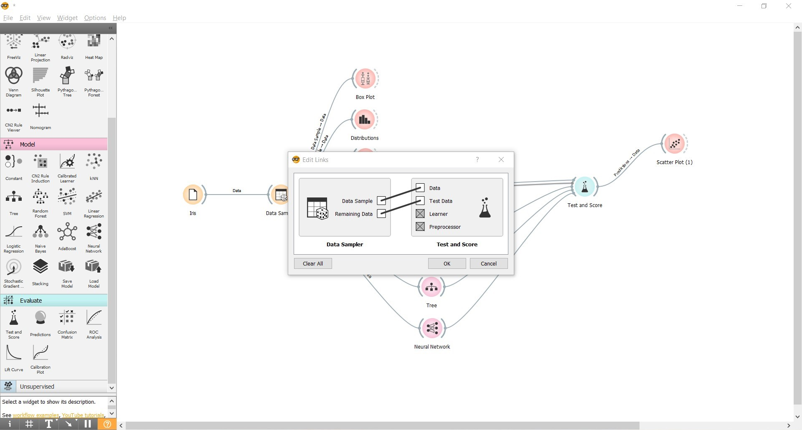

Depois da avaliação, é possível ver os resultados diretamente.

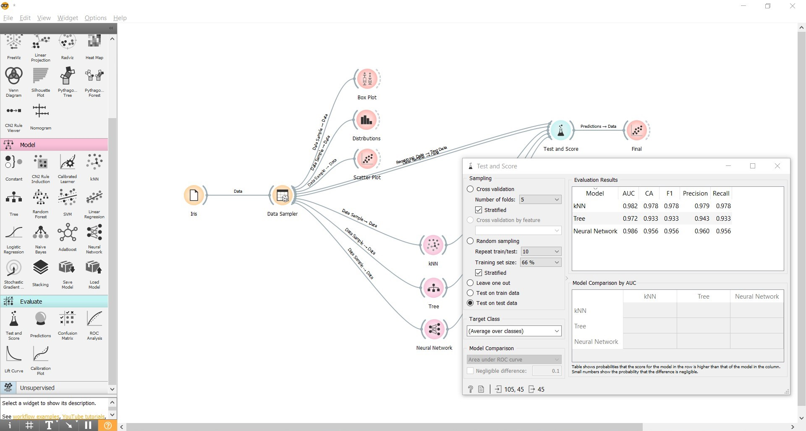

Também pode utilizar outra visualização para comparar visualmente as inferências com os rótulso reais.

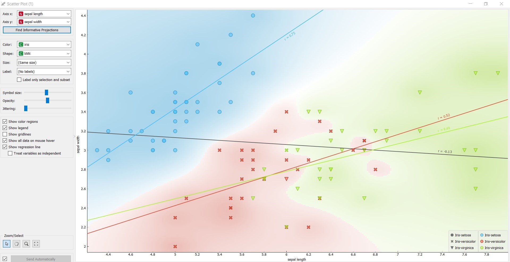

## Outros recursos

[Trabalhando com Orange Data Mining - Aula 01](https://www.youtube.com/watch?v=ljia-1J0ACE&ab_channel=Stack)  
[Visualização da Informação com Orange](https://edisciplinas.usp.br/pluginfile.php/4919774/mod_resource/content/1/Orange_slides.pdf)